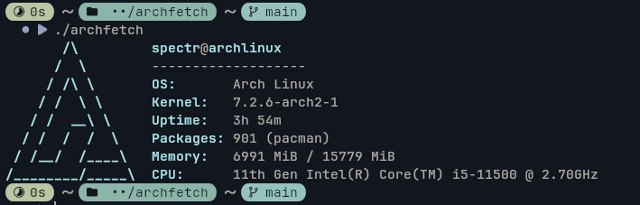

# 🚀 Archfetch

A lightweight, fast, and simple system information fetcher written in pure **C11** for **Arch Linux**.


---

## 📷 Screenshot



---

## ✨ Features

- **Fast & Minimal**: Written in pure C without heavy external dependencies.
- **Direct System Reading**: Parses `/proc` and `/etc` files directly (`/proc/sys/kernel/osrelease`, `/proc/uptime`, `/proc/meminfo`, `/proc/cpuinfo`, `/etc/os-release`).
- **Pacman Integration**: Counts installed packages directly via `/var/lib/pacman/local`.
- **ANSI Colorized Output**: Beautiful Arch Linux ASCII art with colorful text layout.

---

## 🛠️ Build & Installation

### Prerequisites

Ensure you have `gcc`, `make`, and standard C library headers installed:

```bash
~$ sudo pacman -S base-devel
~$ git clone https://github.com/SpectrumDev-fetch/archfetch.git
~$ cd archfetch
~$ make
~$ ./archfetch
~$ make clean